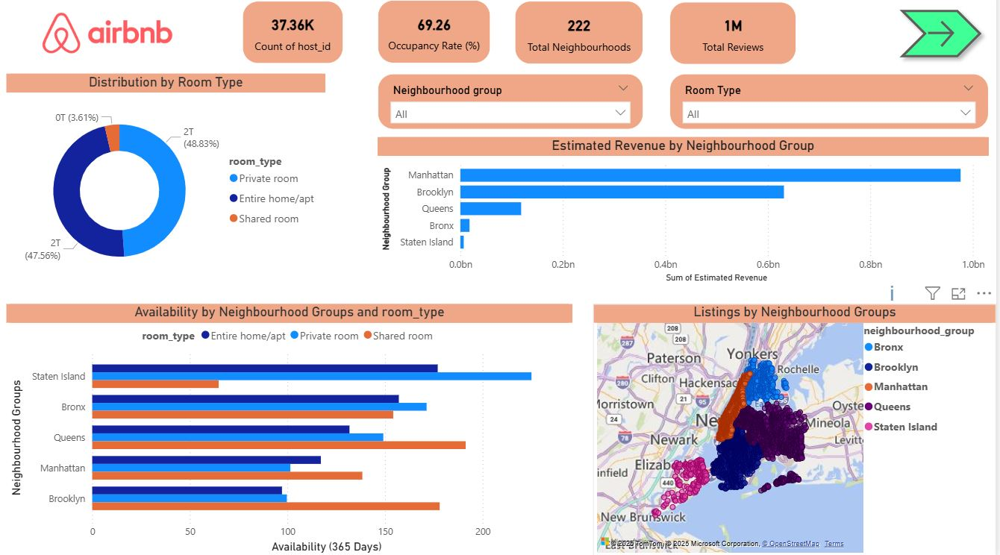
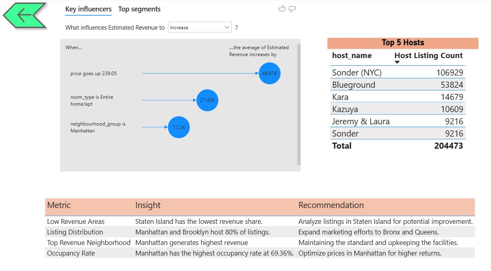

  

#  Airbnb: Exploratory Data Analysis on Airbnb Dataset

## Business Context 
Airbnb is a brand known globally in the property rental/hospitality industry, offering travellers flexibility, affordable, and localized alternatives compared to hotels. The platform caters to a growing preference for personalized and immersive travel experiences, especially for people who prefer independent stay, flexibility and budget constraints. In major cities like New York, where hotel prices are too high and demand is constant, Airbnb property listings have surged in both number and variety. 
However, the property rental industry also faces increased scrutiny from city regulators, with concerns about housing affordability and community impact.

##  Business Context

The core objective of this project is to analyze Airbnb listings in New York City to identify the key factors influencing listing prices, availability, and demand. By uncovering patterns across different neighborhoods, room types, and host behaviors, the goal is to help Airbnb hosts and property managers optimize their pricing strategies and improve listing performance. These insights can further support Airbnb in refining their business strategies to drive better customer experiences and revenue growth.

##  About the Dataset
The  dataset contains airbnb listing data for the year 2019 and has around 49,000 observations in it with 16 columns and it is a mix of categorical and numeric values.
-id	
-name	
-host_id	
-host_name	
-neighbourhood_group	
-neighbourhood	latitude	
-longitude	
-room_type	
-price	
-minimum_nights	
-number_of_reviews	
-last_review	
-reviews_per_month	
-calculated_host_listings_count	
-availability_365

##  Data Preprocessing  
The columns Name and Host name had missing values, they are filled with 'N/A' since their count is very low and it won't make much difference in our further analysis. The review_per_month column was filled with 0 where the values were missing, which typically means that the property has not received any reviews, so assuming the same for our case and replacing null values with 0.

## Actionable Insights  
- Manhattan being the most expensive neighbourhood with the highest average price we can infer that it could be driven by higher demand
- Staten Island and the Bronx show lower overall review counts across all room types, which may indicate less activity or fewer listings in these neighborhoods.
- The majority of listings are for "Entire home/apartment" constituting 52.0% of the total listing.
- Shared room has the lowest average price, making it the most affordable across all the neighborhood and preferred listing for people on a low budget.

## Dashboard

## Technologies Used

- **Python**: Data cleaning, transformation, visualization (Pandas, Matplotlib, Seaborn)
- **Jupyter Notebook**: For code execution and narrative analysis
- **Power BI**: For building interactive dashboards
- **Dataset**: `AB_NYC_2019.csv` from Kaggle or Airbnb open datasets

>  **This project is a purely academic exercise and is not affiliated with or endorsed by Airbnb.

